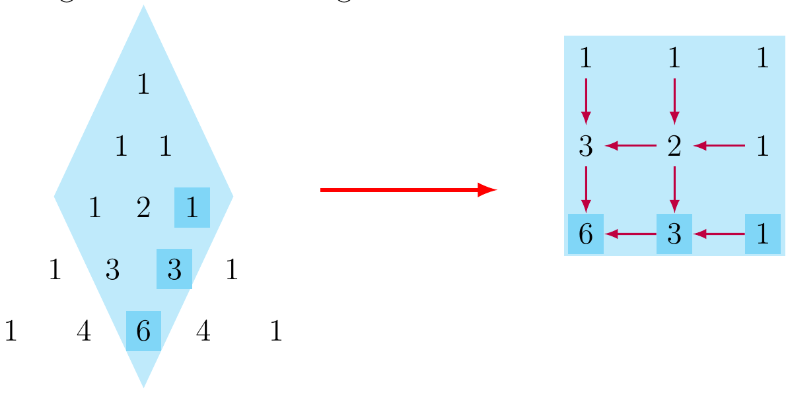

# Pascal's Diagonals
#### Returns an array containing the first *l* numbers from the *n*-th diagonal of Pascal's triangle.
Python technical assessment for 3DVS.

## How does it work?

Since we are unable to use any external function such as _math.comb(n, k)_ we need to generate the Pascal' triangle. Suppose that _n=3_ and _l=2_ For that case we generate the Pascal's triangle shown in the next figure (left side).

The purpose of this function is to write an efficient function, so we ignore all the elements which are not needed (we just need to calculate the shaded ones). We take those numbers and build an array (right side), then to calculate the numbers we just start from the top left corner and start adding accorging to the arrows. Finally, we recover the last column of the array in reversed order.
